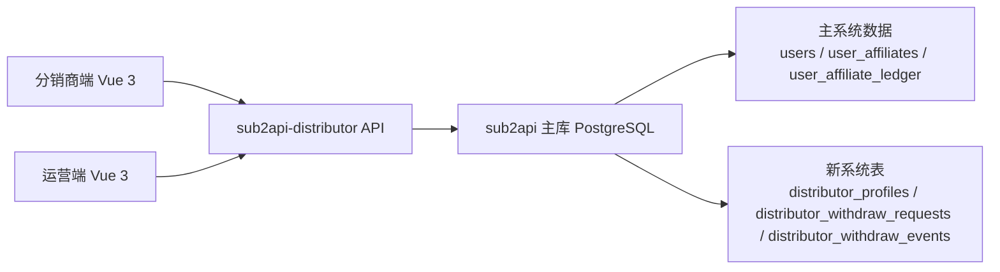
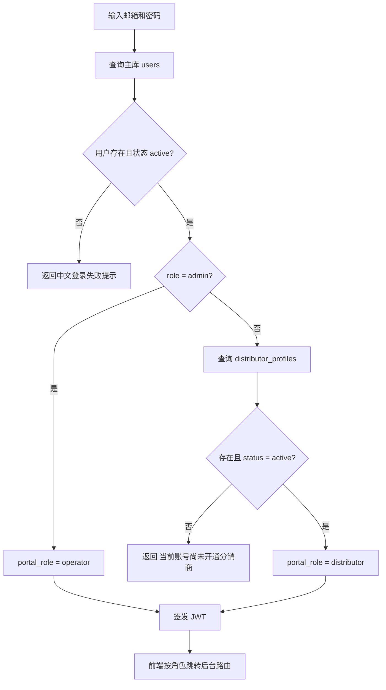
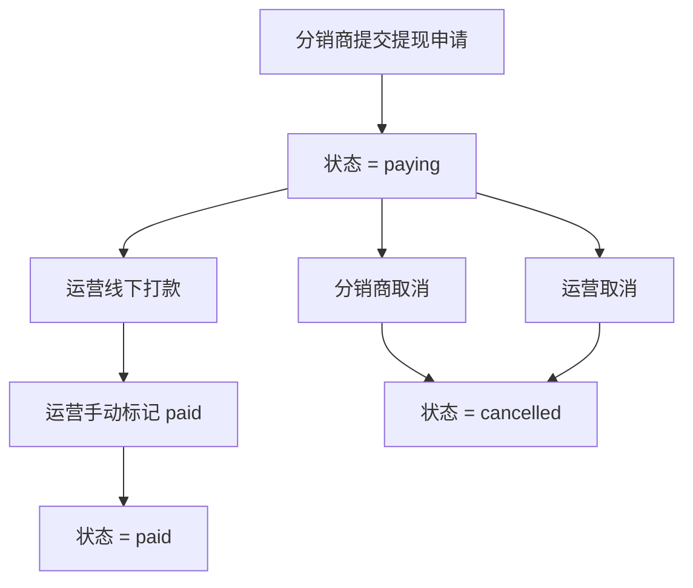

# sub2api-distributor 功能说明文档

## 1. 背景

`sub2api-distributor` 是独立于主系统 `sub2api` 的分销商结算门户。它不替代主系统原有 `affiliate` 页面，而是把“分销商返利查询 + 线下打款结算”拆成独立系统。

核心目标：

- 分销商看清楚自己邀请来的用户、返利和可提现金额
- 分销商发起提现申请后立即看到 `打款中`
- 运营线下打款后在系统中手动标记 `已打款`

## 2. 系统结构



## 3. 角色与登录

### 角色

- `distributor`
- `operator`

### 登录规则

1. 用户必须存在于主库 `users`
2. `users.status` 必须是 `active`
3. `users.role = admin` 时进入 `operator`
4. 非 admin 用户必须在 `distributor_profiles` 中存在 `status = active` 的记录，才能进入 `distributor`

### 登录流程图



## 4. 返利金额口径

新系统不直接拿旧系统 `aff_quota` 作为提现余额，而是按流水和提现单重新计算：

```text
withdrawable_amount =
  total_earned
  - frozen_amount
  - internal_transferred_amount
  - paying_amount
  - paid_amount
```

字段来源：

- `total_earned`
  - `user_affiliate_ledger.action = 'accrue'`
- `frozen_amount`
  - `user_affiliate_ledger.action = 'accrue'`
  - `frozen_until > now()`
- `internal_transferred_amount`
  - `user_affiliate_ledger.action = 'transfer'`
- `paying_amount`
  - `distributor_withdraw_requests.status = 'paying'`
- `paid_amount`
  - `distributor_withdraw_requests.status = 'paid'`

## 5. 邀请码与邀请关系

邀请码来自主系统 `user_affiliates.aff_code`，新系统只是读取并展示，不重新生成。

对应接口：

- `GET /api/portal/invite-meta`

分销商端现在可以直接看到：

- 邀请码
- 指向主系统注册页的邀请链接

邀请码本身是真实的主库邀请码，邀请链接会拼接到配置的主系统注册入口。是否能形成返利，要看主系统里是否真的通过该关系建立了邀请链和后续返利流水。

## 6. 提现状态机

当前只有三种状态：

- `paying`
- `paid`
- `cancelled`

流程图：



金额占用规则：

- 创建申请后，金额立即从 `withdrawable_amount` 扣减
- 标记 `paid` 后累计到 `paid_amount`
- 标记 `cancelled` 后释放回可提现金额

## 7. 前端页面结构

### 分销商端菜单

- 概览
- 邀请用户
- 返利明细
- 提现申请
- 收款信息

概览页当前包含：

- 累计返利
- 可申请金额
- 打款中
- 已打款
- 最近提现记录
- 最近返利记录

邀请码与邀请链接当前放在：

- `邀请用户` 页面顶部的 `邀请入口` 卡片

### 运营端菜单

- 分销商管理
- 提现管理

## 8. 运营如何开通分销商

运营端可通过 `分销商管理` 页面搜索主系统已有用户，然后为用户创建或更新 `distributor_profiles` 记录。

当前实现还会在启用分销身份时自动确保主库 `user_affiliates` 存在，因此运营开通完成后，分销商应立即可以获取邀请码，而不是只具备登录能力。

关键条件：

- 如果没有这条记录
- 或者 `status != active`

那么该用户无法登录分销商后台，并会收到中文提示 `当前账号尚未开通分销商`

当前实际前端/接口文案已经统一为中文：

- `当前账号尚未开通分销商`
- `提现金额超过当前可申请金额`
- `系统开小差了，请稍后重试`

## 9. 当前 API 概览

### 分销商端

- `POST /api/auth/login`
- `GET /api/me`
- `GET /api/portal/dashboard`
- `GET /api/portal/invite-meta`
- `GET /api/portal/invitees`
- `GET /api/portal/rebates`
- `GET /api/portal/withdrawals`
- `POST /api/portal/withdrawals`
- `POST /api/portal/withdrawals/:id/cancel`
- `GET /api/portal/settlement-profile`
- `PUT /api/portal/settlement-profile`

### 运营端

- `GET /api/ops/distributors`
- `GET /api/ops/users/lookup`
- `GET /api/ops/distributors/:userId`
- `PUT /api/ops/distributors/:userId/profile`
- `GET /api/ops/withdrawals`
- `GET /api/ops/withdrawals/:id`
- `POST /api/ops/withdrawals/:id/mark-paid`
- `POST /api/ops/withdrawals/:id/cancel`

## 10. 当前质量基线

本项目当前已经具备：

- 后端核心单元测试
- 前端轻量单元测试
- API 验收脚本
- OpenSpec 变更工件
- 后端导出代码注释

如果后续要继续加强，下一步最值得做的是：

- service/handler 层数据库集成测试
- 前端页面级组件测试
- CI 自动执行上述验证命令
