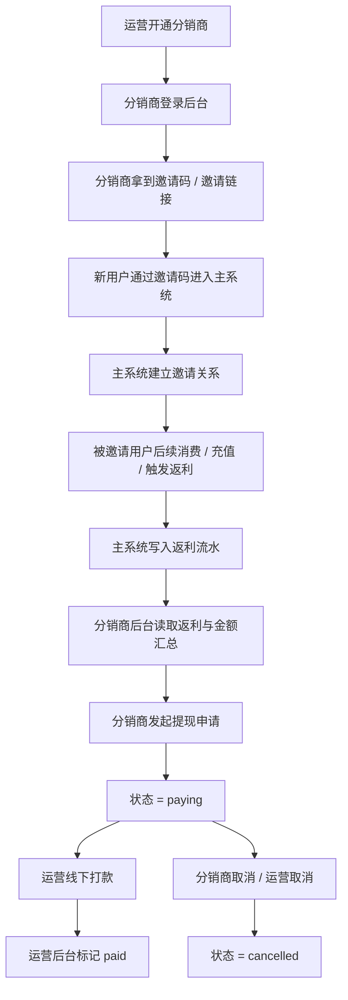
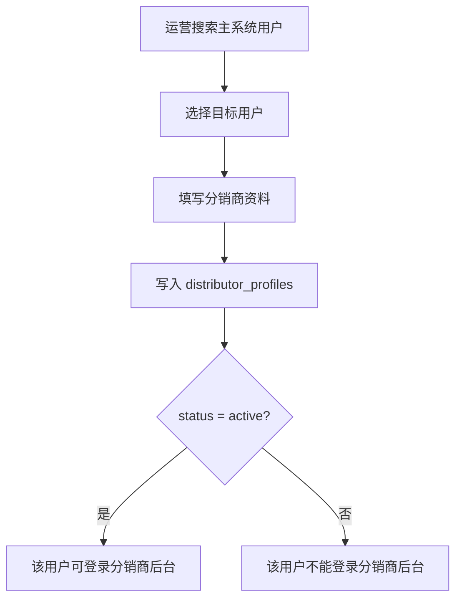
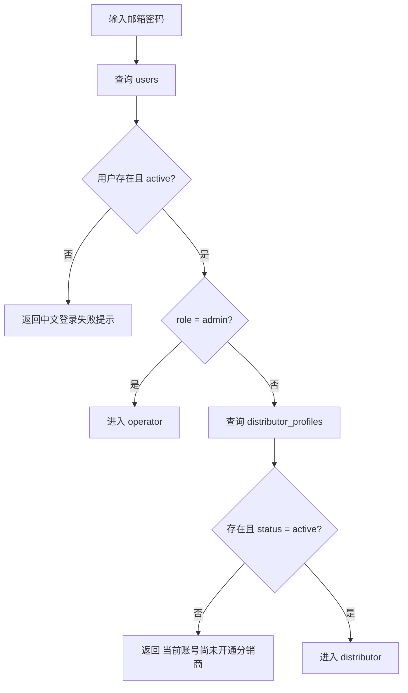
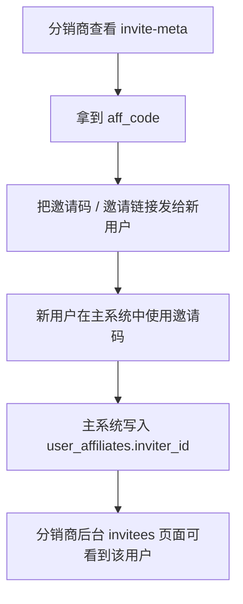
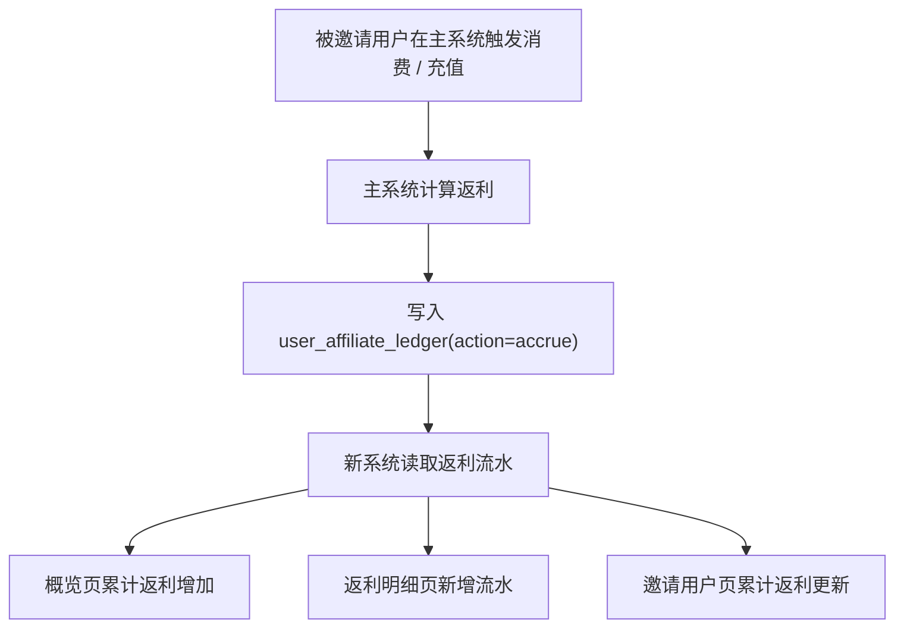
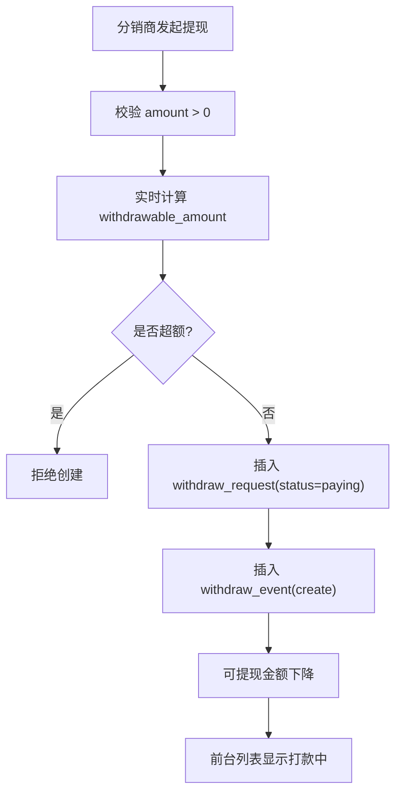
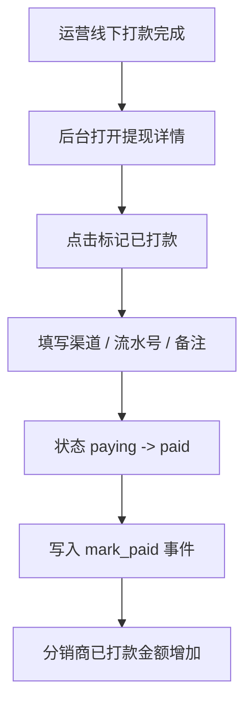

# sub2api-distributor 全工作流说明

## 1. 背景与目标

这份文档专门说明 `sub2api-distributor` 里所有已经跑通的业务工作流，不只讲接口，也讲：

- 谁来操作
- 在什么页面操作
- 系统内部查哪些表
- 金额是怎么流转的
- 用户在页面上最终能看到什么

适用对象：

- 产品 / 运营
- 前后端开发
- 测试 / 演示人员

这份文档基于当前已经跑通的本地版本：

- 前端：`http://127.0.0.1:5177`
- 后端：`http://127.0.0.1:8091/api`

---

## 2. 参与角色

系统里一共分 3 类参与方：

| 角色 | 在哪个系统 | 作用 |
| --- | --- | --- |
| 普通主系统用户 | `sub2api` 主系统 | 被邀请注册、消费、产生返利来源 |
| 分销商 | `sub2api-distributor` | 邀请用户、查看返利、发起提现 |
| 运营 | `sub2api-distributor` | 开通分销商、查看提现、线下打款后手动标记 |

注意：

- 普通用户是否能进分销商后台，不看主系统菜单，而看 `distributor_profiles`
- 运营是否能进运营后台，看主系统 `users.role = admin`

---

## 3. 整体总流程



---

## 4. 工作流一：运营开通分销商

### 4.1 谁来做

- 运营

### 4.2 在哪里做

- 登录后进入 `运营后台`
- 菜单：`分销商管理`

### 4.3 页面操作

1. 点击 `开通分销商`
2. 搜索主系统已有用户
3. 选择一个用户
4. 填写显示名称、收款方式、收款账号、备注
5. 点击 `确认开通`

### 4.4 后端实际做了什么

运营搜索用户时：

- 查主系统 `users`
- 左连接 `distributor_profiles`
- 看这个人是不是已经开通过分销商

运营确认开通时：

- 调用 `PUT /api/ops/distributors/:userId/profile`
- 实际写入或更新 `distributor_profiles`

关键字段：

- `user_id`
- `status`
- `display_name`
- `settlement_channel`
- `settlement_account_name`
- `settlement_account_no`

### 4.5 开通成功后有什么效果

如果满足：

- `distributor_profiles` 有这条记录
- `status = active`

那么这个用户下次登录时就能进入分销商后台。

如果没有这条记录，或者状态不是 `active`：

- 登录会提示 `当前账号尚未开通分销商`

### 4.6 流程图



---

## 5. 工作流二：分销商登录后台

### 5.1 谁来做

- 已开通的分销商
- 运营管理员

### 5.2 登录判断逻辑



### 5.3 分销商登录后能看到什么

左侧菜单固定是：

- 概览
- 邀请用户
- 返利明细
- 提现申请
- 收款信息

### 5.4 运营登录后能看到什么

左侧菜单固定是：

- 分销商管理
- 提现管理

---

## 6. 工作流三：分销商获取邀请码并邀请用户

### 6.1 谁来做

- 分销商

### 6.2 在哪里看

- 分销商后台 `邀请用户`
- 页面顶部的 `邀请入口` 卡片

### 6.3 邀请码是哪里来的

邀请码不是新系统生成的，而是主系统已有的：

- 来源表：`user_affiliates`
- 字段：`aff_code`

新系统只是读取：

- `GET /api/portal/invite-meta`

### 6.4 这个邀请码真实吗

是真实的主库邀请码。

也就是说：

- 如果主系统里这个用户本来就有邀请码，新系统会读出来
- 新系统不会自己造一套独立邀请码体系

### 6.5 邀请关系什么时候真正成立

只有当新用户在主系统里真的通过该邀请码建立了邀请关系后，才算成立。

关键关系表：

- `user_affiliates.user_id`
- `user_affiliates.inviter_id`

### 6.6 页面上最终能看到什么

分销商会看到：

- 自己的邀请码
- 自己的邀请链接
- 邀请用户列表

如果邀请关系已经建立，`邀请用户` 页面会展示：

- 用户 ID
- 邮箱
- 用户名
- 累计返利
- 邀请时间

### 6.7 流程图



---

## 7. 工作流四：被邀请用户触发返利

### 7.1 谁来触发

- 被邀请用户在主系统中的后续消费行为

### 7.2 返利在哪里产生

返利不是新系统自己计算出来的，而是主系统先写好流水，新系统再读取。

核心来源表：

- `user_affiliate_ledger`

关键字段：

- `user_id`
  - 返利归属给谁
- `action`
  - `accrue` 表示返利入账
  - `transfer` 表示旧系统里转成站内余额
- `amount`
- `source_user_id`
  - 这笔返利是哪个被邀请用户带来的
- `source_order_id`
  - 如果有订单来源，可用于展示

### 7.3 新系统怎么理解返利

新系统只认这些流水，不直接认旧系统 `aff_quota` 为提现余额。

它会把：

- `action = 'accrue'` 当作累计返利
- `action = 'transfer'` 当作已转站内余额，要扣掉

### 7.4 分销商页面哪里能看到

1. `概览`
   - 累计返利
   - 可申请金额
   - 打款中
   - 已打款
2. `返利明细`
   - 每一笔返利记录
3. `邀请用户`
   - 每个邀请用户给你累计带来了多少返利

### 7.5 流程图



---

## 8. 工作流五：分销商金额是怎么计算出来的

### 8.1 金额公式

```text
withdrawable_amount =
  total_earned
  - frozen_amount
  - internal_transferred_amount
  - paying_amount
  - paid_amount
```

### 8.2 每个值是什么意思

| 字段 | 含义 | 来源 |
| --- | --- | --- |
| `total_earned` | 历史累计返利 | `user_affiliate_ledger action='accrue'` |
| `frozen_amount` | 还在冻结期的返利 | `accrue + frozen_until > now()` |
| `internal_transferred_amount` | 旧系统已转站内余额的返利 | `user_affiliate_ledger action='transfer'` |
| `paying_amount` | 已申请、打款中的金额 | `distributor_withdraw_requests status='paying'` |
| `paid_amount` | 已打款完成的金额 | `distributor_withdraw_requests status='paid'` |

### 8.3 为什么不是直接看 aff_quota

因为旧系统的 `aff_quota` 带有“可转站内余额”的旧语义，不适合作为新系统线下打款口径。

所以新系统统一用：

- 返利流水
- 打款申请单

重新算出一个独立的：

- `withdrawable_amount`

### 8.4 页面上分别对应哪里

在 `概览` 页看到：

- 累计返利 = `total_earned`
- 可申请金额 = `withdrawable_amount`
- 打款中 = `paying_amount`
- 已打款 = `paid_amount`

---

## 9. 工作流六：分销商发起提现申请

### 9.1 谁来做

- 分销商

### 9.2 在哪里做

- 分销商后台
- 菜单：`提现申请`
- 按钮：`发起提现`

### 9.3 页面操作

1. 点击 `发起提现`
2. 填写金额
3. 可选填写备注
4. 提交后弹窗关闭
5. 列表立刻新增一条 `打款中`

### 9.4 后端实际做了什么

创建申请时：

1. 校验金额 `> 0`
2. 实时计算当前 `withdrawable_amount`
3. 如果申请金额超过可提现金额，直接拒绝
4. 插入 `distributor_withdraw_requests`
5. 状态直接写成 `paying`
6. 插入一条 `distributor_withdraw_events(action='create')`

### 9.5 这时金额怎么变化

一旦申请成功：

- 这笔金额会立刻从 `withdrawable_amount` 中扣掉
- 同时进入 `paying_amount`

### 9.6 页面上能看到什么

在 `提现申请` 页面能看到：

- 申请单号
- 申请金额
- 状态 = `打款中`
- 申请前可提金额
- 申请时间

### 9.7 流程图



---

## 10. 工作流七：分销商取消提现申请

### 10.1 谁来做

- 分销商自己

### 10.2 条件

只有：

- `status = paying`

时，分销商才能取消。

### 10.3 页面操作

1. 在 `提现申请` 列表中找到状态为 `打款中` 的记录
2. 点击 `取消申请`
3. 确认弹窗
4. 提交成功后列表刷新

### 10.4 后端实际做了什么

- 校验这条单据是否属于当前用户
- 校验当前状态能否从 `paying -> cancelled`
- 更新 `distributor_withdraw_requests.status = cancelled`
- 插入 `distributor_withdraw_events(action='cancel')`

### 10.5 金额怎么变化

取消后：

- 这笔金额从 `paying_amount` 中移除
- 回到 `withdrawable_amount`

### 10.6 页面看到什么

- 原来 `打款中` 的记录变成 `已取消`
- 可申请金额会恢复

---

## 11. 工作流八：运营查看和处理提现申请

### 11.1 谁来做

- 运营

### 11.2 在哪里做

- 运营后台
- 菜单：`提现管理`

### 11.3 页面能做什么

- 看全部提现申请
- 按状态筛选
- 查看详情
- 标记已打款
- 取消申请

### 11.4 查看详情时能看到什么

详情弹窗会展示：

- 申请单号
- 申请金额
- 当前状态
- 申请时间
- 申请快照
  - 申请前可提现
  - 申请后可提现
  - 打款渠道
  - 打款流水号
- 操作时间线
  - `create`
  - `mark_paid`
  - `cancel`

### 11.5 对应后端

列表：

- `GET /api/ops/withdrawals`

详情：

- `GET /api/ops/withdrawals/:id`

---

## 12. 工作流九：运营标记已打款

### 12.1 谁来做

- 运营线下已经打款后

### 12.2 页面操作

1. 找到一笔 `打款中`
2. 点击 `标记已打款`
3. 填写：
   - 打款渠道
   - 打款流水号
   - 打款备注
4. 提交

### 12.3 后端实际做了什么

- 校验状态必须是 `paying`
- 更新：
  - `status = paid`
  - `paid_at`
  - `paid_channel`
  - `paid_reference_no`
  - `paid_remark`
- 插入 `distributor_withdraw_events(action='mark_paid')`

### 12.4 金额怎么变化

标记成功后：

- 这笔金额不再属于 `withdrawable_amount`
- 不再属于 `paying_amount`
- 转入 `paid_amount`

### 12.5 页面看到什么

- 列表状态从 `打款中` 变 `已打款`
- 详情里能看到打款渠道、流水号和时间线
- 分销商概览页 `已打款` 会增加

### 12.6 流程图



---

## 13. 工作流十：运营取消提现申请

### 13.1 谁来做

- 运营

### 13.2 场景

比如：

- 线下不再处理
- 金额有问题
- 需要让分销商重新申请

### 13.3 限制

只有 `paying` 单据可取消。

### 13.4 结果

- 状态变成 `cancelled`
- 写入 `cancel` 事件
- 金额释放回分销商可提现金额

---

## 14. 工作流十一：收款信息维护

### 14.1 谁来做

- 分销商
- 运营也可以维护

### 14.2 分销商在哪里改

- 菜单：`收款信息`

### 14.3 运营在哪里改

- `分销商管理`
- 开通分销商弹窗 / 更新资料

### 14.4 存在哪里

- `distributor_profiles`

主要字段：

- `settlement_channel`
- `settlement_account_name`
- `settlement_account_no`
- `settlement_account_extra`
- `notes`

### 14.5 作用

这部分不是自动打款系统字段，而是给运营线下打款时参考的收款资料。

---

## 15. 工作流十二：演示 / 测试工作流

### 15.1 初始化演示数据

```bash
cd /Users/lhl/Desktop/code/sub2api-distributor
./scripts/seed_demo_data.sh
```

它会自动生成：

- 运营账号
- 分销商邀请人
- 分销商被邀请人
- 邀请关系
- 返利流水
- 提现申请与事件

### 15.2 启动服务

后端：

```bash
cd /Users/lhl/Desktop/code/sub2api-distributor
SERVER_PORT=8091 \
DATABASE_DSN='postgres://sub2api@localhost:5432/sub2api?sslmode=disable' \
JWT_SECRET='sub2api-distributor-dev-secret' \
go run -mod=mod ./backend/cmd/server
```

前端：

```bash
cd /Users/lhl/Desktop/code/sub2api-distributor/frontend
pnpm dev --host 127.0.0.1 --port 5177
```

### 15.3 自动验收

```bash
cd /Users/lhl/Desktop/code/sub2api-distributor
./scripts/api_acceptance.sh
```

当前验收已经覆盖：

- 分销商登录
- 分销商邀请码
- 邀请用户
- 返利明细
- 提现申请创建 / 取消
- 运营登录
- 分销商列表
- 主系统用户搜索
- 分销商详情
- 运营标记已打款
- 运营取消申请

报告文件：

- [api-acceptance-latest.md](/Users/lhl/Desktop/code/sub2api-distributor/test-results/api-acceptance-latest.md)

---

## 16. 当前业务边界

这套系统现在已经做的是：

- 分销商返利查询
- 邀请关系展示
- 邀请码读取展示
- 提现申请
- 线下打款状态管理

这套系统现在还没做的是：

- 自动打款
- 审核流
- 主系统里自动生成支付订单来驱动分销结算
- 复杂分页、导出、统计报表

所以你可以把它理解成：

> 一个独立的“分销商返利结算后台”，而不是一个自动支付结算平台。

---

## 17. 你现在最关心的几句话总结

### 17.1 怎么让一个用户变成分销商

- 运营在 `分销商管理` 里给他写一条 `distributor_profiles`
- 且 `status = active`

### 17.2 分销商的邀请码是不是主系统真实邀请码

- 是

### 17.3 返利金额到底从哪里来

- 从主系统 `user_affiliate_ledger` 里的 `accrue` 流水来

### 17.4 分销商能提现吗

- 可以发起提现申请
- 系统会显示 `打款中 / 已打款 / 已取消`
- 真实打款是运营线下完成

### 17.5 系统会自动打款吗

- 不会

### 17.6 分销商提交申请后为什么马上显示打款中

- 因为这个系统没有审核流
- 创建申请后状态直接就是 `paying`

### 17.7 运营打完款后怎么让页面变成已打款

- 在 `提现管理` 中手动点 `标记已打款`
